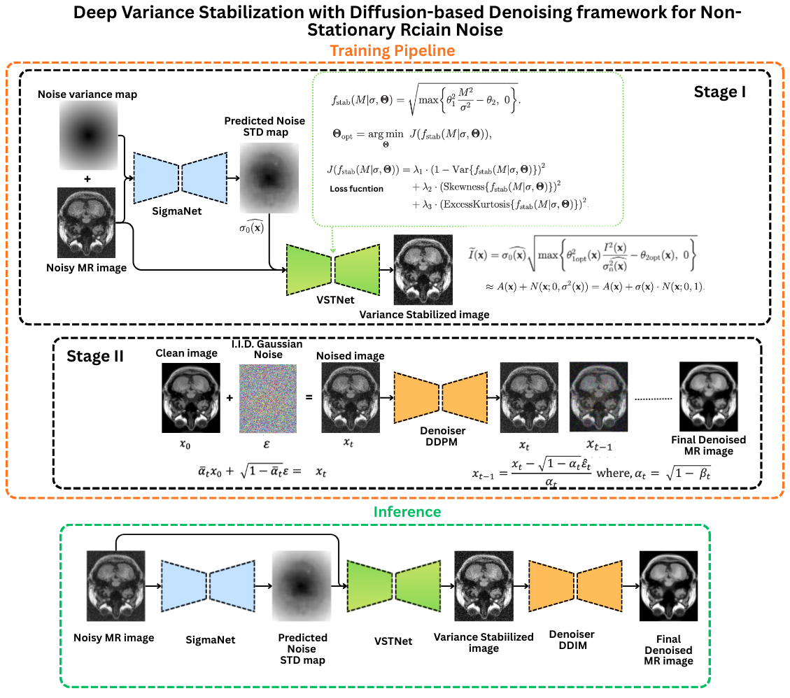

# Deep Variance Stabilization + Diffusion Denoising for Non-Stationary Rician MRI Noise


## Overview

Magnetic Resonance Imaging (MRI) magnitude images are corrupted by **Rician-distributed noise**. Classical MRI denoisers typically assume **stationary** noise, which holds approximately for ideal single-coil acquisitions.

However, in real clinical scanners with:

- multi-coil receivers
- coil sensitivity maps
- GRAPPA/SENSE reconstructions
- partial k-space acquisitions

the noise becomes **spatially varying**, leading to **non-stationary Rician noise**. This breaks assumptions made by denoisers and diffusion models trained on IID Gaussian noise.

To resolve this, we propose a **two-stage denoising pipeline**:

> **Dataset → SigmaNet → VSTNet → Diffusion → Denoised MRI**

---
<p align="center">
  
</p>

---
## Pipeline Summary

### Stage I — Variance Stabilization (Physics-Informed)

1. **SigmaNet** predicts spatial noise variance
2. **VSTNet** transforms non-stationary Rician → stationary Gaussian

Given I(x) (MRI magnitude) and σ₀(x) (noise variance from SigmaNet), VSTNet predicts two positive parameters:

u₁(x) > 0
u₂(x) ≥ 0

The stabilized image is computed as:

I_tilde(x) = sigma0(x) * sqrt( (u1(x)^2 * I(x)^2 / sigma0(x)^2) - u2(x) )


### Stage II — Diffusion Denoising

Diffusion denoisers operate on IID Gaussian corrupted images:

Ĩ = x₀ + σ·ε,    ε ~ N(0, 1) in training 


After VST, the stabilized image:
Ĩ = A₀ + σ(x).N(x;0,1),  

The diffusion model then removes the approximately IID Gaussian noise from the variance-stabilized image.


---

## Key Contributions

✔ Handles **non-stationary Rician** MRI noise  
✔ Converts MRI noise to **Approximate Gaussian** for diffusion    
✔ Uses: DDPM for training and DDIM for inference.  
✔ Trained and tested on simulated Brain MRI datasets. 

---

# 🔧 Pipeline Steps + Commands

---

## 1. Synthetic Non-Stationary Rician Dataset

```bash
python syn_non_stat_rician_add.py \
  --in_dir <clean_mri_folder> \
  --out_dir <output_dataset_folder> \
  --n_aug 1 \
  --sigma_map_mode radial \
  --sigma_blur 25.0 \
  --percentNoise 11.0 \
  --seed 0 \
  --save_png \
  --save_clean_npy
 ```
Produces:
```bash
clean_npy/
noisy_npy/
sigma_npy/
noisy_png/
sigma_png/
manifest.csv
```
# 2. Train SigmaNet (Noise Variance Estimator)
```bash
python train_homomorphic_sigmanet.py \
  --manifest <manifest.csv> \
  --base_dir <root_dir> \
  --out_dir <sigmanet_ckpts> \
  --epochs 30 \
  --batch_size 8 \
  --lr 1e-3 \
  --wd 1e-4 \
  --val_split 0.1 \
  --blur_ksize 31 \
  --blur_sigma 7.0 \
  --base 32 \
  --input_mode h_only \
  --tv_weight 0.05 \
  --max_viz 3 \
  --amp
  ```
# 3. SigmaNet Inference
```bash
python infer_homomorphic_sigmanet.py \
  --ckpt <sigmanet_best_or_last.pth> \
  --manifest <manifest.csv> \
  --base_dir <root_dir> \
  --out_dir <sigma_predictions> \
  --input_mode h_only \
  --blur_ksize 31 \
  --blur_sigma 7.0 \
  --eval_gt
```
Produces: 
```bash
sigma_pred_npy/
sigma_pred_png/
metrics.csv
```
# 4. Train VSTNet (Variance Stabilizer)
```bash
python train_vstnet_fixed.py \
  --out_dir <vstnet_runs> \
  --synthetic 0 \
  --noisy_dir <noisy_png> \
  --sigma_dir <sigma_npy> \
  --sigma_kind npy \
  --sigma0_is_variance 0 \
  --pad_multiple 8 \
  --device cuda \
  --epochs 20 \
  --batch_size 8
```
# 5. VSTNet Inference → Generate Stabilized Images
```bash
python infer_vstnet_fixed.py \
  --ckpt <vstnet_ckpt.pt> \
  --noisy_dir <noisy_png> \
  --sigma_dir <sigma_npy> \
  --sigma_kind npy \
  --sigma0_is_variance 0 \
  --pad_multiple 8 \
  --out_dir <vst_output> \
  --device cuda \
  --batch_size 8 \
  --num_workers 2 \
  --log_every 10 \
  --use_snr_proxy 0 \
  --blur_ks 21 \
  --blur_sigma 3.0 \
  --save_extra 0
```
Outputs:
```bash
I_tilde_npy/   <-- used for diffusion training
I_tilde_png/
u1_u2.csv
```
# 6. Diffusion Training (Stage II)
```bash
python mri_denoiser_controlled_noise.py \
  --mode train \
  --image_size 0 \
  --train_clean <clean_folder> \
  --train_batch_size 16 \
  --train_steps 100000 \
  --timesteps 1000 \
  --save_dir <output_dir>
```
# 7. Diffusion Inference
```bash
python mri_denoiser_controlled_noise.py \
  --mode denoise_few \
  --image_size 0 \
  --weights <checkpoint>.pt \
  --noisy_folder <input_folder> \
  --out_folder <output_folder> \
  --few_steps 20 \
  --eta 0.0
```


## Core requirements
```bash
    pip install torch numpy opencv-python scikit-learn matplotlib scikit-image pillow
 ```

## 📄 License

Released under the [MIT License](LICENSE).

##  Author

Maintained by [Israt Zarin Era](https://github.com/IE0005)
